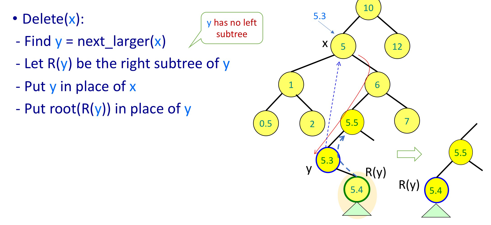
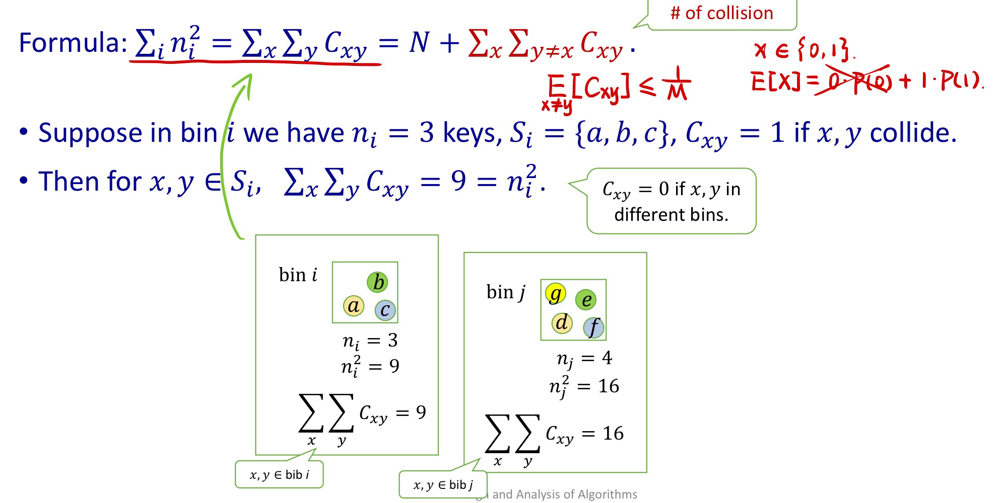
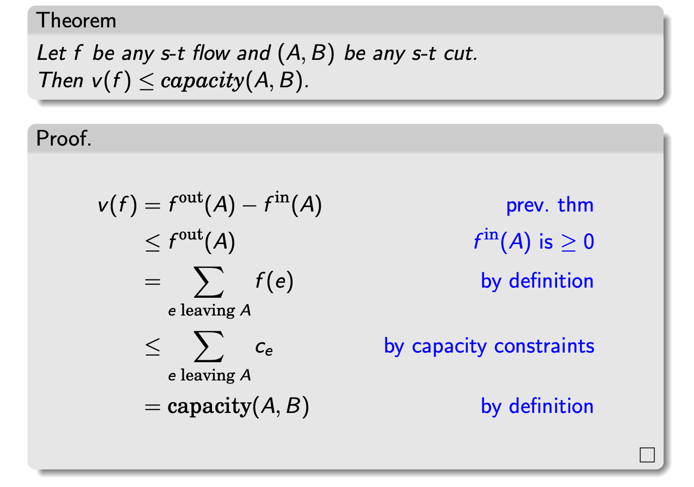

[TOC]

## Master Theorem

### Recursion tree

$T(n) = aT(n/b) + f(n)$

1. (Geometrically increasing) If $f(n) = O(n^{\log _{b} a - \varepsilon})$, $T(n) = \Theta(n^{\log _{b} a})$
2. (Roughly equal levels)
    1. If $f(n) = O(n^{\log _{b} a})$, $T(n) = \Theta(n^{\log _{b} a}\log n)$
    2. If $f(n) = O(n^{\log _{b} a} \log n)$, $T(n) = \Theta(n^{\log _{b} a}\log^2 n)$
3. If $f(n) = O(n^{\log _{b} a + \varepsilon})$ and $a f(n/b) \leqslant sf(n), s<1$, $T(n) = \Theta(f(n))$

证明：(informal) 构造等比数列 (formal version see slides L01_2 p.21-23)

### Peak Finding Problem

#### 1D Array

Strategy: Consider the middle element of the array and compare with neighbors. If the middle element is not a peak, we can infer what side of the peak it is in and throw the redundant part.

$T(n) = T(n/2) + O(1) = \Theta(\log n)$

#### 2D Version

$T(n) = \Theta(n)$

## Divide and Conquer Algorithm

### Convex Hell

Brute-force: $\Theta(n^3)$ ($O(n^2)$ edges, $O(n)$ tests per edge, an edge is valid iff all points are in one side).

Dvide and Conquer: $T(n) = 2 T(n/2) + \Theta(n)) = \Theta(n\log n)$.

1. (Initialize) Sort all points by $x$-coordinate. $O(n\log n)$.
2. Divide into half A and half B and handle half A and half B sub-problems.
3. Merge A and B. Start with $a, 𝑏$. While $y(i, j)$ increases, keep moving by one step either $a_{i}$ counterclockwise or $b_{j}$ clockwise. When cannot increase any more, we found the upper tangent. The lower tangent is similar. Θ(𝑛).

### Median Finding (Quicksort)

1. Select a pivot $x$.
2. Computer partition |B| $x$ |A|, derive $k$ = rank($x$).
3. If $k$ = i, return x, if $k$ < i return (Part A, i-k), else return (Part B, k).

- (Drawback) The theoretical worsest time is $O(n^2)$.

### Randomized (probabilistic) algorithms

Las Vegas algorithm, Monte Carlo algorithm. (use **Markov inequality** to tranform the type)

#### Randomized Quicksort

	

A different version: Repeat picking a random $x$ until Rank(x) between $[\frac{1}{4}n, \frac{3}{4}n]$.
The probability is $p=\frac{1}{2}$，$T(n)_{avg} = T(\frac{n}{4})_{avg} + T(\frac{3n}{4})_{avg} + 2cn = \Theta(n \log n)$.

#### Matrix Multiplication Verification

1. If $AB \neq C$, the probability of $ABr \equiv Cr \mod 2$ is less than $\frac{1}{2}$. Hence the probability of 10 trails of $AB \neq C$ that all say "yes" (wrong classification) is $(\frac{1}{2})^{10}$.
2. To prove the probability of wrong classification $<\frac{1}{2}$, we just need to prove that for any $r$ such that $(AB-C)r = 0$, there always exists a unique $v$ makes $(AB-C)(r+v) \neq 0$.
    Note: $v$ is dependent on matrix $AB-C$. One possible construction of $v$ is only the $j$-th bit of  $v$ is 1 ($j$ should satisfy $d_{ij}=0$ for some $i$), while the other bits are 0. [Reference](https://zhuanlan.zhihu.com/p/80629756)

### Fast Fourier Transform

#### Basci idea & Mathematical facts

**Fact 1.** Polynomial multiplication takes linear time in the value representation.
**Fact 2.** $A\left(x_{i}\right) =A_{e}\left(x_{i}^{2}\right)+x_{i} A_{o}\left(x_{i}^{2}\right) \quad A\left(-x_{i}\right) =A_{e}\left(x_{i}^{2}\right)-x_{i} A_{o}\left(x_{i}^{2}\right)$
**Fact 3.** The $n$th roots are plus-minus paired, $\omega^{n / 2+j}=-\omega^{j}$. Squaring them produces the ($n/2$)nd roots of unity.

From the fact above, we could develop The fast Fourier transform algorithm.

==**Fact 4.**== \<values\> = FFT(\<coefficients\>, $\omega$)   \<coefficients\> = $\cfrac{1}{n}$FFT(\<values\>, $\omega ^{-1}$).
The matrix in the middle (denoted as $M$) is called the *Vandermonde* matrix.
$$
\left[\begin{array}{c}
A\left(x_{0}\right) \\
A\left(x_{1}\right) \\
\vdots \\
A\left(x_{n-1}\right)
\end{array}\right]=\left[\begin{array}{ccccc}
1 & x_{0} & x_{0}^{2} & \cdots & x_{0}^{n-1} \\
1 & x_{1} & x_{1}^{2} & \cdots & x_{1}^{n-1} \\
& & \vdots & & \\
1 & x_{n-1} & x_{n-1}^{2} & \cdots & x_{n-1}^{n-1}
\end{array}\right]\left[\begin{array}{c}
a_{0} \\
a_{1} \\
\vdots \\
a_{n-1}
\end{array}\right]
$$
**Fact 5.** If $x_{0}, . . . , x_{n−1}$ are distinct numbers, then $M$ is invertible. In brief, evaluation is multiplication by $M$, while interpolation is multiplication by $M ^{−1}$.
**Fact 6*.** Vandermonde matrices also have the distinction of being quicker to invert than more general matrices, in $O(n ^2 )$ time instead of $O(n ^3 )$.

In FFT, we chooose $1, \omega, \cdots, \omega^{n-1}$ to replace $x_0, x_{1}, \cdots, x_{n-1}$, we have
$$
M_{n}(\omega)=\left[\begin{array}{ccccc}
1 & 1 & 1 & \cdots & 1 \\
1 & \omega & \omega^{2} & \cdots & \omega^{n-1} \\
1 & \omega^{2} & \omega^{4} & \cdots & \omega^{2(n-1)} \\
& & \vdots & & \\
1 & \omega^{j} & \omega^{2 j} & \cdots & \omega^{(n-1) j} \\
& & \vdots & & \\
1 & \omega^{(n-1)} & \omega^{2(n-1)} & \cdots & \omega^{(n-1)(n-1)}
\end{array}\right]
$$
The columns of $M(\omega)$ is are orthogonal to each other and they compose the *Fourier basis* system. The inverse of $M$ is the opposite rotation, from the Fourier basis back into the standard basis. 

**Fact 7.** $M_{n}(\omega)^{-1}=\frac{1}{n} M_{n}\left(\omega^{-1}\right)$. 第一次 $\times M$ 旋转变换时基长度 $\times \sqrt{n}$，两次作用 $M$ 后 $|base|=n$.

#### The fast Fourier transform unraveled

Implement details: https://oi.men.ci/fft-notes/

### Multiplication

Multiply 2 $n$-bit numbers, the usual way: $\Theta(n ^ 2)$.

Matrix multiplication:

## Sorting and Trees

### Decision trees

A *decision tree* can model the execution of any **comparison sort**:

- A path from the root to the leaves of the tree represents a trace of comparisons that the algorithm may perform.
- The running time of the algorithm = the length of the path taken.

The possible outcomes($n!$) after comparisons are leaves. The best time complexity is $\Theta(n!) = \Theta(n \log n)$.

**Remark:** decision tree is a method for construction lower bounds for searching and sorting algorithms.

Merge sort $\Theta(n \log n)$, insertion sort $\Theta(n ^ {2})$, Counting sort $\Theta(n+m)$.
Radix sort $\Theta((n + m)\log _ {m} n)$: Sort on least-significant digit first with auxiliary stable sort.

**Correctness of radix sort**: Induction on digit position.
• Assume that the numbers are sorted by their low-order $t–1$ digits
• Sort on digit $t$. (1) Two numbers that differ in digit $t$ are correctly sorted; (2) Two numbers equal in digit $t$ are put in the same order as the order based on the previous $t-1$ digits, which is assumed to be correct.

### Heaps

**Heap = an array** visualized as a nearly complete binary tree.
[Navigate on the tree but move on array ( = full info of tree)]

- *build_max_heap*: Apply bottom-up *max_heapify*. ==$T(n) = 2T(n/2) + c\log n \Rightarrow T(n) = O(n)$==.
- *max_heapify*: **correct a single violation** of the heap property occurring at the root of a sub-tree in $O(\log n)$. （自顶向下）
- *insert, extract_max(delete)*: insert from the bottom, remove from the root. $O(\log n)$.
- *Heapsort*: sort an array of size $n$ in $O(n \log n)$ using heaps. （优化插入排序找最大值部分）
- *increase_key, decrease_key*: move and swap up/down respectively.

**Remark:** Heaps maintain only **partial ordering** of elements. 
              Why we need BST? ==Precursor/Successor==.

### BST

- *insert, find, findmin, findmax*: go left/right by comparing the value of current node and children.
- Tree traversals: *pre-order, in-order, post-order*.
- *next-larger, delete*: see slides below.
- Query: How many elements $\leq t$. (idea: keep the total size of subtree at each node)

### AVL Tree

[Adelson-Velskii and Landis’62]
**Property:** for every node, store its height (“augmentation”).
**Invariant:** for every node x, the heights of its left child and right child differ by at most 1.

### Interval Tree

1. 以左端点建立平衡树。
1. 节点额外维护子树内右端点的max。
1. 查询区间[l, r]：l<left_child[m] 就往左走，否则往右。

- 难点在于证明算法的正确性：首先 end_left < end_right，如果 l<end_left，r 如果和右子树overlap必先和左子树overlap。More specifically, 若要和右子树overlap，[l, r] 要跨过 end_left，此时已和左子树区间相交。

### Van Emde Boas Tree

To derive $O(\log \log u)$, we need $T(u) = T(\sqrt u) + O(1)$.

Key ideas: maintain ==**clusters**== and ==**summaries**== to ensure fast operations in every **block**.

Fancy idea: keep the min outside the data structure, do “lazy updates”: in insert(x), if x < y = min, then min = x, insert(y).

## Hashing

Definition: Hash function is any function that maps data of arbitrary size to fixed-size values.

### Models for randomness ("good" hash function)

#### Simple Uniform Hashing Assumption

Choose **randomly** a key $k$ according to a uniform distribution on the key space $U$. Then $h(k)$ is distributed over the hash table with **equal probability**.
$$
\text{Pr}[h(k) = i] = \frac{1}{m}, 0 \le i < m
$$
	

#### Universal hash functions

“Hashing game”: if our adversary knows the hash function, he will choose the $n$ keys so they hash to the same location in the table if possible. We can instead pick a hash $h$ function at random (independently of the keys) from a very large set $H$. The goal is for $\forall k, r \in U, k \neq r$, 
$$
|\{h:h(k) = h(r)\}| \le \frac{|H|}{m}
$$
也就是说对任两个元素，hash函数集中的冲突函数的比例不超过 $\frac{1}{m}$.

**Theorem:** Pick uniformly at random $h$ from a universal set $H$ and build a table $T$ of size $m$, where $n$ keys have already been inserted in. For any new key $x$, the expectation of collisions in the $T$ is $\leq \alpha$, where $\alpha$ is the load factor and equals $\frac{n}{m}$.

**Example. The matrix method**
$$
h \circ x = h(x) \Rightarrow \left(\begin{array}{llll}
1 & 0 & 0 & 0 \\
0 & 1 & 1 & 1 \\
1 & 1 & 1 & 0
\end{array}\right)\left[\begin{array}{l}
1 \\
0 \\
1 \\
0
\end{array}\right]=\left[\begin{array}{l}
1 \\
1 \\
0
\end{array}\right]
$$

**Remark:**

1. 假设 $x, y$ 在位置 $i$ 的 bit 互不相同，若 $h(x) = h(y)$，通过变换 $i$-column **可以构造** $m-1$ 个 $h^{\prime}$ 满足 $h^{\prime}(x) \neq h^{\prime}(y)$。
2. 此外，对不同函数通过变换 $i$-column 构造方式得到的函数**相互独立**。更具体地，若 $h(x) =h(y)$，$g(x) = g(y)$ 变换 $i$-column （相同的 $i$）可以构造额外 $2(m-1)$ 个互不相同的函数。（更本质地，这是因为 $h$ 和 $g$ 的 rest columns 不相同，因为 $h$ 和 $h^{\prime}$ 遍历了整个 $i$-column）

### Construct good hashing functions

**Example 2.** $h_{a}(x^{4\times 1}) = (\sum _{i=1}^{4} a_{i}x_{i}) \mod m$, $m$ is a prime.

Proof. $a_{1}(x_{1}-y_{1}) = - \sum_{i=2}^{4}a_{i}(x_{i}-y_{i}) \mod m$
$a_{1} = - (\sum_{i=2}^{4}a_{i}(x_{i}-y_{i}))(x_{1}-y_{1})^{-1} \mod m$, for any fixed $a_{2}, a_{3}, a_{4}$.
The probability of choosing the "right" $a_{1}$ is $\frac{1}{m}$.

**Example 3.** $h_{a,b}(x) = (ax+b \mod p) \mod m$, $p$ is a large prime.

Idea: $ax+b \mod p$ is uniformly distributed in $[0,p-1]$, then it is still uniform after $\mod m$.

### Open Addressing

| S.No. | **Separate Chaining**                                        | **Open Addressing**                                          |
| :---- | :----------------------------------------------------------- | :----------------------------------------------------------- |
| 1.    | Chaining is Simpler to implement.                            | Open Addressing requires more computation.                   |
| 2.    | In chaining, Hash table never fills up, we can always add more elements to chain. | In open addressing, table may become full.                   |
| 3.    | Chaining is Less sensitive to the hash function or load factors. | Open addressing requires extra care to avoid clustering and load factor. |
| 4.    | Chaining is mostly used when it is unknown how many and how frequently keys may be inserted or deleted. | Open addressing is used when the frequency and number of keys is known. |
| 5.    | Cache performance of chaining is not good as keys are stored using linked list. | Open addressing provides better cache performance as everything is stored in the same table. |
| 6.    | Wastage of Space (Some Parts of hash table in chaining are never used). | In Open addressing, a slot can be used even if an input doesn’t map to it. |
| 7.    | Chaining uses extra space for links.                         | No links in Open addressing                                  |

source: https://www.geeksforgeeks.org/hashing-set-3-open-addressing/

**Performance of Open Addressing:**

Like Chaining, the performance of hashing can be evaluated under the assumption that each key is equally likely to be hashed to any slot of the table (simple uniform hashing) 

> $m$ = Number of slots in the hash table
> $n$ = Number of keys to be inserted in the hash table
> Load factor $\alpha = \frac{n}{m} < 1$ 
> Expected time to search/insert/delete < $\frac{1}{1-\alpha}$ (*unsuccessful search*, i.e., find an empty slot)
> So Search, Insert and Delete take $\frac{1}{1-\alpha}$ time.

**Open Addressing Methods:**

Linear probing: $h(k, i) = (h ^{\prime} (k) + i) \mod m$. (consecutive positions)
Quadratic probing: $h(k, i) = (h ^{\prime} (k) + c_{1}i + c_{2}i^{2}) \mod m$.
Double hashing: $h(k, i) = (h_{1} (k) + i h_{2} (k)) \mod m$.
Cuckoo hashing: uses 2 hash functions, if one of position is occupied, move the value to the other one by recursion (other value may also should be moved). (issue: does not work when encounters a cycle)

### Other Hashing

Rolling hashing: hashing in a large text, transforming strings to polynomial values.

### Applications to cryptography: RSA Algorithm

- Factoring problem: no efficient way to integer factorization algorithm is known.

- Primality testing: it is easy to use Fermat's test to determine if a large integer $N$ is prime.

    

- Generating a random $n$-bit prime: a random $n$-bit number has roughly a $\frac{1}{n}$ chance of being prime, which means there is an abundance of primes.

## Amortized Analysis

The amortized analysis balances together the more costly and less costly operations during the execution of the system. It assigns a representative cost to each operation, the “amortized cost”, that **in the long run its sum covers the total actual cost generated by these operations** for any system execution.

**Table doubling**

$n$ insertions in a table of $m$ slots. It generates $\lfloor \log n \rfloor$ times doubling.
Pay $c\left(2^{0}+2^{1}+2^{2}+2^{3}+\cdots+2 \lfloor\log n\rfloor+1\right) = c(2^{\lfloor \log n \rfloor + 2 - 1}) = \Theta(n)$ total cost.
Average cost per insertion is: $\cfrac{\Theta(n)}{n} = \Theta(1)$.

**2-3 trees**

A 2-3 tree is a tree data structure in which every internal node (non-leaf node) has either one data element and two children or two data elements and three children. 2-3 trees are balanced with $O(\log n)$ for basic operations.

### Accounting method

Accounting method allows an operation to deposit (or get back) money using some bank account besides
paying for the actual cost (note: account cannot become < 0).

**Example:**

When inserting an element, store also a coin $c=\Theta(1)$.
• When table must double: $n\rightarrow 2n$, there are $n/2$ coins in the bank. Use them to pay for the $\Theta(2n)$ table rebuilding cost: choose $c$ s.t. $\Theta(2n)-\frac{n}{2}c = 0$.
• Amortized cost per “normal” insert: $\Theta(1)+c = \Theta(1)$
• Amortized cost per “rebuild” insert: $\Theta(1) + c$
We use $\frac{n}{2}c = \Theta(2n)$ from bank to cover table rebuild cost $\Theta(2n)$.
Hence at each time the total amortized cost covers the total actual cost.

### Charging method

Charging method allows operations to charge cost retroactively to past operations.

==Amortized cost of operation = actual cost – total charge to past ops + total charge by future ops==

**Example:**

When table doubles, charge $\Theta(2n)$ cost to $\frac{n}{2}$ inserts since last doubling. Hence each insert is charged only once $\cfrac{\Theta(2n)}{n/2} = \Theta(1)$.

### Potential method

### Balls and Bins

Key **inequalities** in probability theory:

Markov's inequality ($X \ge 0$): $P[X \ge t] \le \cfrac{E[x]}{t}$.
Chebyshev's inequality: $P[|X-E[X]| \ge t] \le \cfrac{Var[X]}{t^{2}} = \cfrac{E[(X-\mu)^{2}]}{t^{2}}$.
Hoeffding's inequality: $P[|\cfrac{S_{n}}{n} - \mu| > \alpha] < 2e^{-a^{2}n}$.

**Questions:** we throw $n$ balls to $m$ bins, we wanna know the *average number of balls in a bin, average number of empty bins, average number of collisions, how many balls on the average we need to throw to have all bins full, average number of balls in the most loaded bin*, ...

Expected number of empty bins $E[Z] = m(1-\frac{1}{m})^{n} \rightarrow n\frac{1}{e}$.

The birthday paradox $E[X_{ij}] = \frac{1}{m}$, $E[X] = \sum_{i<j} E[X_{i, j}] = \frac{1}{m} \binom{n}{2}$.

Expected time until all bins are full $E[X_{i}] = \frac{1}{p_{i}} = \frac{m}{m-(i-1)}$, $E[X] = \sum_{i=1,\dots,m} E[X_{i}] = m (1 + \frac{1}{2} + \dots + \frac{1}{m})$.

The max-load process $L = O(\cfrac{\log n}{\log \log n})$. (whp: with high probability)

Proof. Pr[bin $i\ge k$ balls] $\le \binom{n}{k}\frac{1}{n}^{k}$. Pr[bin $i\ge \frac{4 \log n}{\log \log n}$ balls] $<\frac{1}{n^2}$.
(Use stirling's approx.: $k! > (\frac{k}{e})^{k}$, and Union bound $P(A \cup B) \le P(A) + P(B)$)

Improvement: (with “choice of two”, i.e., “minimum” load balancing) $L = O(\cfrac{\log \log n}{\log \log \log n})$.

### Perfect Hashing

$N$ keys, hash table size $M$. Can we make the **actual time** $T=O(1)$ using $O(N)$ space?

idea: choose **the right hash function** from a set $H$ of universal hash functions.

Step1: using space $N^{2}$. $C_{xy} = 1_{h(x) = h(y)}$, $P_{h}[C_{xy} = 1] \le \frac{1}{M} = \frac{1}{N^{2}}$. P[there is a collision] $\le \binom{N}{2} \frac{1}{N^{2}} < \frac{1}{2}$.

Step2: using space $O(N)$.

### Bloom Filters

To check membership of $y$ in $S$, check whether $h_{i}(y) = 1, \forall i = 1, \dots, k$.

- If not, $y$ is definitely not in $S$ (no false-negative).

- If yes, we conclude that $y \in S$, but sometimes this conclusion is wrong (we allow for false-positive).

    For many applications, false positives are acceptable as long as the probability of a false positive is small enough.

- Note that **no deletions** are allowed (otherwise we may get false-negatives).

**Counting Bloom filters**: instead of using a single bit, we replace every entry in a counting Bloom filter with a small counter (4bits).

Applications: Distributed caching (of web pages), P2P: finding location of files, Network routing, Packet routing, Flow control, Recording heavy flows.

**Remark:**

Bloom filters 的优点是空间效率和查询时间都比一般的算法要好的多，存储空间和插入/查询时间都是常数。缺点是有一定的误识别率和删除困难。另外, Hash函数相互之间没有关系，方便由硬件并行实现。

## Graph

### Strongly connected component

- Graph of SCCs is a DAG. (Collapses to a DAG)

- Property of DAGs: If there is an edge 𝑢 → 𝑣, then 𝑝𝑜𝑠𝑡 𝑢 > 𝑝𝑜𝑠𝑡(𝑣).

- **Property of any graph G:** For any DFS Given SCCs 𝐶, 𝐶', If there is an edge 𝐶→𝐶', then 𝑝𝑜𝑠𝑡 𝐶 > 𝑝𝑜𝑠𝑡 𝐶'.

    

- Property: If 𝐶 and 𝐶′ are strongly connected components, and there is an edge from a node in 𝐶 to a node in 𝐶′ (𝐶→𝐶'), then, with any DFS, **the <u>highest post number</u> of the nodes in 𝐶 is bigger than <u>the highest post number</u> in 𝐶′**.

- ==**Kosaraju’s algorithm:**== <u>Reverse the graph!</u> Do the DFS in the reverse graph $G^T$ Then <u>the largest post number</u> will be for a state $u_1$ in the sink 𝑆𝐶𝐶 of the original graph 𝐺.
    Then, keep exploring 𝐺 using DFS starting from $u_1$, <u>output the corresponding SCC and remove it from 𝐺</u>. Then, repeat the process by <u>choosing the next state with highest post number</u>, etc. $O(|V|+|E|)$

### Shortest Path Problem (single source)

In the problem, we always wanna know on each node $v$:

1. The shortest path distance $\delta(v)$.
2. The derivation of shortest path $v.\pi$ (predecessor node).

Important property of optimal paths:

- Any sub-path from a optimal path is optimal.
- In general, $\delta(s, t) \leq \delta(s, u) + \delta(u, t)$.
- No negative cycles: shortest paths are always “simple” (no repetition of nodes).

### Bellman-fold Algorithm

- But if there are negative edges, how do we know that there is no negative cycle?
- Relax all edges once more: if the values of $\delta _{u}$, $u \in V$ don’t change, we are OK.

Time complexity: $O(nm)$.

### Dijkstra's Algorithm

Idea: guess the sequence of the relaxations and relax each edge only once. (Topological sort in DAGs)

**Time complexity:** $O(V\log V + E)$.

### A* Algorithm

- Dijkstra: priority = **$g(v)$ : past cost = cost to reach 𝑣**.
- A\* : priority = $f(v)=g(v)+h(v)$.

Idea: I make an edge shorter if it brings me closer to the goal.

## Greedy Algorithm

### Minimum Spanning Tree

**Kruskal’s Algorithm**: Repeatedly add the next lightest edge that doesn’t produce a cycle.

Implementation:

- 按秩合并：there are at least $2^k$ nodes in a tree with rank=k. (maximum rank = $\log n$) $O(|E|\log|V| + |E|\log|V|)$
- 路经压缩：$O(|E|\log|V| + |E|)$, including sorting time.

**Prim's Algorithm**: the intermediate set of edges 𝑋 always forms a subtree, and 𝑆 is chosen to be the set of this tree’s vertices. (Strongly reminiscent of Dijkstra’s algorithm)

### Huffman encoding

Commonly used in file compression based on *prefix-tree* property.

Decoding is unique: a string of bits is decrypted by starting at the root, reading the string from left to right to move downward (left as 0 and right as 1), and whenever a leaf is reached, outputting the corresponding symbol and returning to the root.

### Set cover

NP-C Problem, but can be solved by greedy algorithm approximately.

## Dynamic Programming

**Dynamic programming (DP):** conceived to optimally plan *multistage* processes. Usually refers to simplifying a decision by breaking it down into *a sequence of decision steps* over time.

Important ideas:

- Recursion: Divide the problem into ***sub-problems***, so that their solutions can be
    combined into a solution to the problem.
- Tabulation of sub-problems (**memoization**): Solve each sub-problem just once and save its solution
    in a ***“look-up” table***.
- Solve sub-problems in a “causal” sequence from smaller to larger. In general: topological sort of *sub-problem dependency graph*. (DAG structure)

### Shortest Path Problem (single source)

 

Regularization of DP equations:

Why shortest path work? Answer: optimal path $\cup$ optimal path = optimal path.

for DP we need the following properties:

1. The problem must exhibit optimal substructure.
    • Optimal solution contains optimal solution of sub-problems.
2. The sub-problems can be solved independently.

### All-pairs Shortest Paths (Floyd Algorithm)

Solution 1: (bad) $O(n^4)$

Solution 2: $O(n^3)$

### Text Justification

$DP[i]$: minimum possible cost for words $[i \dots n]$. $DP[i] = \min \{line\_cost(i, j-1) + dp[j]\}$. $O(n^2)$.

### Parenthesization (interval DP)

### Longest Common Subsequence (LCS)

### Activity Scheduling

Observation: it is always optimal to schedule first the activity with the shortest finishing time! $O(n)$

### Traveling Salesman Problem (TSP)

NP-C Problem.

### Knapsack Problem

**(0/1) Knapsack Problem**: Knapsack size $S$, item $i$ has size $s_i$, value $v_i$.

Sub-problem: 𝐷𝑃[𝑖, 𝑋]: value for prefix $i$ = value from packing optimally items 1,...,𝑖 in a space X.

Recursion: 𝐷𝑃[𝑖,𝑋] =max{𝐷𝑃[𝑖−1,𝑋], 𝑣$_i$+𝐷𝑃[𝑖−1,𝑋−𝑠$_i$]}. $O(nS)$.

**Knapsack problem with repetitions**: given a set of item $n$ types, and a knapsack of size $S$.

Recursion: $DP[X] = max\{DP[X-1], \max\limits_{i}\{DP[X-s_i]+v_i\}\}$. $O(nS)$.

**Rewrite DP equations**: We can rewrite the DP equations to achieve a running time of 𝑂(𝑛𝑉) (instead of 𝑂(𝑛𝐵)), where 𝑉 is the sum of the values.

### Balanced Partition

Solution: solve all possible summations and choose the one most close to half. $O(nD)$.

## Network Flow

Def. An $s-t$ flow is a function $f : E → R^{ ≥0}$ that assigns a real number to each edge. (i.e. 每条边用的流量)

Constraints on $f $:

1. $0 \leq f(e) \leq c_{e}$.
2. For each node $v$ except $s$ and $t$, we have: $\sum_{e \text { into } v} f(e)=\sum_{e \text { leaving } v} f(e)$

The value of $f$ is: $v(f) = \sum_{e \text { out of } s} f(e)$.

### Residual Graph

1. $G_f$ contains the same nodes as $G$.
2. **Forward edges:** For each edge $e = (u, v)$ of $G$ for which $f (e) < c_e $, include an edge $e ^{\prime} = (u, v)$ in $G_f$ with capacity $c_e - f(e)$.
3. **Backward edges:** For each edge $e = (u, v)$ of $G$ for which $f (e) < c_e $, include an edge $e ^{\prime} = (v, u)$ in $G_f$ with capacity $f(e)$.

### Augmenting Paths

- Let $P$ be an $s − t$ path in the residual graph $G$.
- Let $\text{bottleneck}(P, f )$ be the smallest capacity in $G_{f}$ on any edge of $P$.
- If $\text{bottleneck}(P, f ) > 0$ then we can increase the flow by sending $\text{bottleneck}(P, f )$ along the path $P$

### Network Flow Algorithms

Ford-Fulkerson Algorithm: $O(mC)$.

Edmonds-Karp algorithm: (use BFS to find the augmenting path) $O(nm^2)$, $C=O(nm)$.

### Proof of correctness (Max-Flow = Min-Cut)

## Complexity

### Search Problems

**Search** problem: any *decision problem* (Y/N) whose answer YES + can be justified by a solution (“certificate”) + an *efficient way* (polynomial time) to check if a proposed solution is indeed a solution. **Property: easy to check, hard to prove/find.**

e.g. Search problem: Does a directed graph *G* have a Hamiltonian cycle? Optimization problem: Find the minimum Hamiltonian cycle of graph *G*.

- Obviously, if we can solve the optimization problem, we can solve the search version, but the opposite is **usually** true too: combine with binary search!
- ==Note: the shortest path in TSP $\iff$ a path $\leq K$ + binary search.==

We say that such problem can be solved in **nondeterministic polynomial time (NP):** when the answer is YES, *guess* a solution and verify it in *p*-time.

The class *NP*: All search problems.

### Problem Classifications

(Unsolvable problem) Halting Problem: Does a program *P* on input *X* terminate?

**Best known algorithms don't have polynomial solution**

- Hamiltonian cycle problem: $O(2^n n^2)$.
- Traveling Salesman Problem TSP: $O(2^n n^2)$.
- Clique, Independent Set, Graph Coloring, 4-way matching, Vertex Cover, Longest path, Multiprocessor Scheduling, Max-Cut, Constraint Satisfaction, Quadratic Programming, Integer Linear Programming, Disjoint Paths, Subset Sum, ...

### Proving **hardness** of problems

Algorithmic “**hardness**”: is the **hypothesis** that a particular problem cannot be solved efficiently (in polynomial time).

**Methodology**

### *NP*-hard, *NP*-complete

- A *NP*-hard problem may not be a *NP* problem.
- **SAT** (Satisfiability): given a Boolean formula, do there exist values for the variables that make it evaluate to TRUE;
- **Cook-Levin Theorem**: 3-SAT is *NP*-complete (hard + *NP*).
- 3-SAT $\leq$ Independent set $\leq$ Vertex cover (all edges)

### *P*-reduction Examples

**Hamiltonian (Rudrata) path and cycle problem**

**Vertex coloring (k-colorable)**

Fact 1: The **vertex** **3-coloring** problem is *NP*-complete.
Fact 2: The **vertex k-coloring** problem is *NP*-complete for *k* > 3.

1. **vertex 3-coloring** $\in$ *NP*. Find a polynomial-time reduction of the **3-SAT** problem to this problem.

    

    

2. **vertex coloring** $\in$ *NP*. Find a polynomial-time reduction of the **vertex** **3-coloring** problem to the **k-coloring** problem. (link every node in the original graph with a *k*-3 clique)

**Cliques in a graph**

**Theorem:** Let *G* ⊆ V be a subset of vertices. Then *G* is a clique in *G* iff *G* is an independent set of $G^{c}$.

**Halting Problem**

*p*-reduce the 3-SAT to the H(P, X): (X is not used)

Hence Halting Problem is *NP*-hard, but it is not *NP*-complete, for it is not *NP*.

**k-Spanning Tree**

Input: An undirected graph *G* = (*V*, *E*)
Output: A spanning tree of *G* in which each node has degree $\leq k$, if such a tree exists.

Notice that 2-spanning tree = the hamiltonian path, which is *NP*-complete. Then reduce 2-tree to k-tree.

**Subgraph isomorphism**

**Longest path & Max sat**

**Dense subgraph & Sparse subgraph**

**Set cover**

### Coping with NP-completeness

**Backtracking** (Search problem)

It is often possible to reject part of the solution space by looking at just a small portion of the problem.

**Branch and Bound** (Optimization problem)
To reject a subproblem corresponding to a partial solution, we must be **certain** that *its cost exceeds that of some other solution we have already encountered*.

**Local Search**
On each iteration, the current solution is replaced by a better one in its neighborhood. But it may converge to local minima with no approximation ratio guarantees.

TSP:

Graph partitioning:

**Randomization**

**Simulated annealing**

## Approximation Algorithms

### Examples

**Vertex covering and maximal matchings**

$M \leq OPT \leq 2M$

**First fit**

**Euclidean TSP**

### Approximation Schemes

**An approximation algorithm**: An approximation algorithm $A_{\varepsilon}$ takes an instance of an optimization problem and a parameter ε > 0 and produces a solution that is within a factor 1 + ε of being optimal (or 1 – ε for maximization problems). For example, for the Euclidean [traveling salesman problem](https://en.wikipedia.org/wiki/Traveling_salesman_problem), a PTAS would produce a tour with length at most (1 + ε)*L*, with *L* being the length of the shortest tour.

**PTAS**: The running time of a PTAS is required to be polynomial in the problem size for every fixed ε, but can be different for different ε. Thus an algorithm running in time $O(n^{1/ε})$ or even $O(n^{exp(1/ε)})$ counts as a PTAS.

**FPTAS**: Importantly, the run-time of an FPTAS is polynomial in the problem size and in 1/ε. This is in contrast to a general PTAS. The run-time of a general PTAS is polynomial in the problem size for each specific ε, but might be exponential in 1/ε.

